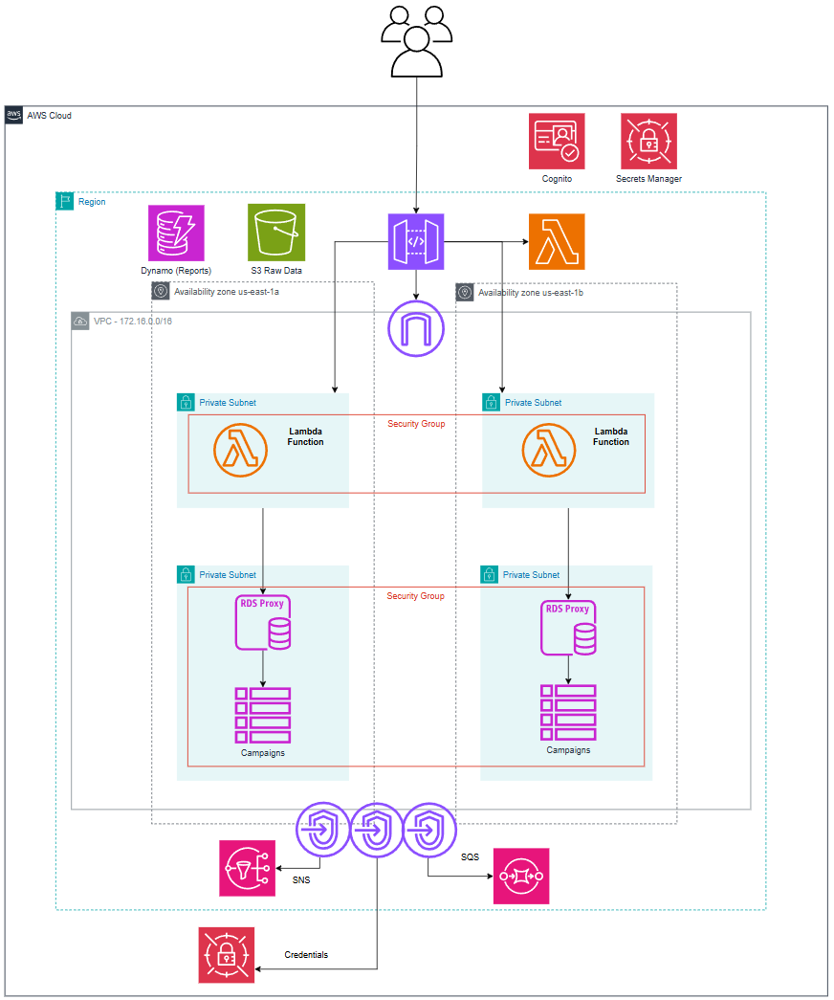

# Marky: Social Media Analytics Platform

Marky is a cloud-based platform for analyzing social media posts from Bluesky using AI-powered insights from Google Gemini. This project combines real-time data ingestion, serverless computing, and a modern web frontend deployed on AWS.

## Architecture Overview

- **Frontend**: SvelteKit application deployed to S3 with CloudFront CDN
- **Backend API**: Lambda functions (API Gateway + DynamoDB)
- **Authentication**: Amazon Cognito
- **Data Storage**: S3 + DynamoDB
- **AI Processing**: Google Gemini API for content analysis
- **Social Media**: Bluesky API integration for post ingestion

## Architecture Diagram


## Prerequisites

- AWS Academy Learner Lab access (provides temporary LabRole credentials)
- Google Gemini API key
- Bluesky account with App Password enabled
- GitHub account with repo access

## Deployment

### Step 1: Configure GitHub Secrets

The professor must add the following secrets to the repository settings (Settings → Secrets and variables → Actions):

| Secret Name | Description |
|---|---|
| `AWS_ACCESS_KEY_ID` | AWS Academy access key |
| `AWS_SECRET_ACCESS_KEY` | AWS Academy secret key |
| `AWS_SESSION_TOKEN` | AWS Academy session token (required) |
| `GEMINI_API_KEY` | Google Gemini API key for report generation |
| `BLUESKY_IDENTIFIER` | Bluesky handle (e.g., handle.bsky.social) |
| `BLUESKY_APP_PASSWORD` | Bluesky app-specific password |

### Step 2: Run Deploy Workflow

1. Go to Actions tab
2. Select "Deploy Infrastructure"
3. Click "Run workflow"
4. Workflow will:
   - Build Lambda functions
   - Initialize Terraform (local backend, no bootstrap needed)
   - Apply infrastructure (creates VPC, RDS, Lambda, Cognito, etc.)
   - Store Gemini API key in AWS Secrets Manager
   - Build and deploy frontend to S3

Expected runtime: 15-20 minutes (RDS instance creation is slowest)

### Step 3: Access Deployed Application

After workflow succeeds:
- Frontend accessible at: `https://<api-id>.execute-api.us-east-1.amazonaws.com/prod/`
- The API URL is output by `terraform output api_url` during the workflow

## Demo: Create a Campaign & View Reports

Walk-through against the deployed URL from Step 3.

1. **Sign up & sign in.** Open `/login`, click **Sign up**, register with an email + password (≥ 8 chars, including upper, lower, and a digit). Confirm via the emailed code, then sign in.

2. **Create a campaign** at `/create`. Sample inputs:

   | Field | Sample | Rule |
   |---|---|---|
   | Name | `fwc_album` | 1–16 chars, lowercase letters + `_` |
   | Topics | `Panini`, `football`, `World Cup` | 1–6 topics, ≤ 15 chars each, lowercase letters / spaces |
   | Start date | today | |
   | End date | today + 7 days | window ≤ 30 days |

   Submit. You land on `/list`.

3. **Open the campaign** at `/list/fwc_album`. The page shows status (Active), date range, latest sentiment score + label, stats grid, executive summary, topic distribution, sentiment timeline, and key Bluesky comments. The orchestrator ingests every ~5 min; until the first cycle completes you'll see `No report available yet.`

4. **Browse past reports.** Click **View past reports** (top-right of the campaign page) or go to `/list/fwc_album/reports`.

   - Default view: the 5 most recent reports, each with timestamp + score + Positive / Neutral / Negative badge.
   - Date-range filter: pick start + end, click **Apply** — URL becomes `?start=…&end=…`. **Reset** clears it.

5. **Open a specific report** at `/list/fwc_album/reports/<timestamp>` (click any row). Full summary, topic distribution, and key comments render.

## Project Structure

```
.
├── .github/workflows/          # GitHub Actions CI/CD pipelines
│   ├── terraform-deploy.yml    # Deploy infrastructure + frontend
│   ├── terraform-destroy.yml   # Tear down infrastructure
│   ├── terraform-format.yml    # Terraform code formatting check
│   ├── tfsec.yaml             # Security scanning
│   └── terraform-docs.yml     # Auto-generate docs
├── terraform/                 # Infrastructure as Code (AWS resources)
├── frontend/                  # SvelteKit web application
├── lambdas/                   # Lambda function source code
└── README.md                  # This file
```

## Cleanup

To tear down all AWS resources:

1. Go to Actions → "Destroy Infrastructure"
2. Click "Run workflow"
3. Enter `destroy` in the confirmation prompt
4. Workflow will run `terraform destroy -auto-approve`

This removes all resources created by the deploy workflow, cleaning up costs.

## AWS Academy Notes

- Credentials are temporary (12-4 hour sessions)
- LabRole has limited permissions (focused on compute, storage, networking)
- Session token is required (AWS Academy enforces MFA-like behavior)
- RDS Proxy endpoint format: `marky-proxy-<suffix>.proxy-xxxxx.us-east-1.rds.amazonaws.com`

## Terraform Configuration

See [terraform/README.md](terraform/README.md) for detailed infrastructure setup, including:
- State management (local backend)
- Variable configuration
- Post-deployment manual steps
- Troubleshooting

## Local Development

See individual component READMEs for local setup:
- Frontend: `frontend/README.md`
- Lambdas: `lambdas/README.md`

## Support

For issues, check the workflow logs in GitHub Actions for detailed error messages and stack traces.
